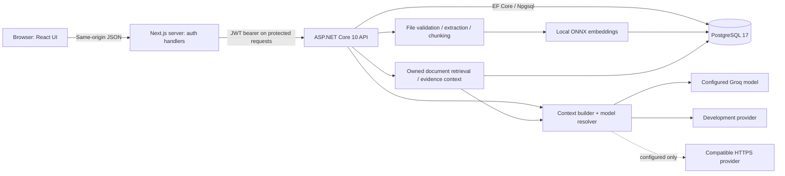

# Architecture through Day 6

## Responsibilities

- **Frontend:** Next.js App Router, React, TypeScript and Tailwind. `/login`, `/register`, protected `/chat`, and `/` redirect. Day 2 adds streaming chat, recent history with pagination, opening a conversation via `/chat?c=...`, rename/delete confirmation, stop/regenerate/copy and safe Markdown/code rendering. Future modules stay disabled.
- **Next.js server:** reads `API_BASE_URL`, forwards authentication to ASP.NET, stores JWT in an HTTP-only SameSite=Lax cookie, and forwards the cookie's token in an Authorization header. The browser receives only the user profile. `lib/api-client.ts` centralizes browser requests and errors; `lib/backend.ts` centralizes server requests/configuration.
- **Backend:** dependency-injected EF context, password hasher and token service; controllers, validation, explicit CORS, rate limiting, JSON logging, Problem Details errors, and development OpenAPI.
- **Database:** users and roles with their existing join table, plus conversations and messages added through a new EF migration. No in-memory/SQLite substitute or data reset was used.
- **AI service:** Python remains a documented future boundary. Day 3 runs local ONNX embeddings inside ASP.NET and calls Groq through the existing model abstraction. No separate microservice is needed.

- **Capability routing:** `CapabilityRouter` is deterministic and server-side. It keeps general and coding requests separate from exam personalization, routes selected documents to RAG, and routes fresh or explicit research to the bounded Research Orchestrator. `ContextBuilder` applies bounded history and capability-specific instructions.
- **Advanced Research:** `ResearchOrchestrator` plans at most two focused searches, ranks source candidates, reads public pages through the P2.1 SSRF boundary, extracts bounded evidence, detects limited numeric/version conflicts and evidence gaps, combines user-owned RAG evidence when selected, and supplies verified provenance to one synthesis call.

## Authentication flow

1. Browser submits name/email/password to Next.js `/api/auth/register` (or email/password to `/api/auth/login`). Forms remain disabled until React is interactive and use POST even as a fallback.
2. Next.js validates Origin and JSON content type, then calls ASP.NET's corresponding endpoint.
3. ASP.NET validates input. Registration normalizes the email, hashes the password with ASP.NET Identity's salted PBKDF2 hasher (210,000 iterations), assigns the seeded `User` role and commits the database transaction. The unique normalized-email index also prevents concurrent duplicates.
4. Login looks up the persisted user, verifies the hash and active flag, and upgrades an older hash if needed. Unknown emails perform a dummy hash verification; invalid email/password responses are uniform.
5. ASP.NET returns a signed HS256 JWT and profile. JWT includes user ID, name, unique token ID, role, issuer, audience and expiry. Expiry is 30 minutes with 10 seconds validation clock skew. Signing key comes from configuration and is validated at startup.
6. Next.js stores the JWT in `spilton_session`, an HTTP-only cookie; no token in localStorage or browser-readable response JSON. Secure defaults on, explicitly off for this local HTTP setup.
7. `/chat` checks the token against `/api/auth/me` before rendering a profile. ASP.NET validates signature, algorithm, issuer, audience, lifetime, active user and required `User` role. Missing/invalid tokens receive 401, insufficient role receives 403. Browser checks the session on focus and every minute.
8. Logout uses an origin-validated POST, expires the cookie and navigates to login. It works without the backend. New protected requests fail after logout because no token is sent.

## Deliberate scope and limitations

No refresh-token/session table: short-lived access tokens are sufficient for today's local foundation. Logout removes this browser's token; a separately copied JWT remains valid until expiry. Immediate token revocation, password reset, email verification, MFA and production session policy are not implemented.

Auth endpoints are limited to 20 attempts per minute per API connection IP. Next.js forwards requests server-side, so local browser users share this limit. This is a development safeguard, not a distributed production abuse-control system.

CORS allows only the configured development origin. Same-origin cookie mutations additionally require the exact configured Origin. CORS itself does not authenticate clients. No wildcard CORS or permissive forwarded-IP trust is enabled.

Structured errors return validation Problem Details, 401/403, duplicate 409, rate limit 429, dependency 503, or generic 500. No password hashes appear in API response DTOs. Database sensitive-data logging is not enabled; the custom exception handler logs type and trace ID without request bodies or secrets.

## Day 2 chat boundary

The browser calls the allowlisted same-origin `/api/chat/...` proxy. It retrieves the HTTP-only token server-side and forwards the request to authenticated ASP.NET conversation/model routes. Mutations require the exact configured Origin, and request bodies are limited. Stream bodies pass through without being fully buffered.

ASP.NET scopes every conversation lookup to the JWT user ID. Another user's IDs return 404 for read, rename, delete, send, regenerate and stop. Clients cannot supply a trusted owner ID or system-message role. A PostgreSQL advisory lock serializes generation, rename and deletion per conversation; concurrent sends return 409.

Messages are durable before generation starts. Assistant partials are checkpointed about once per second and finalized on success, error, timeout or cancellation. Successful regeneration supersedes the previous answer without deleting its stored content; failed regeneration leaves the old answer visible on reload. Unfinished records left by an API crash are marked failed once older than three minutes. Context excludes failed/cancelled/superseded responses and browser-supplied system messages.

Quick mode invokes `IModelProvider.StreamAsync` through `IModelProviderResolver` / `ModelProviderFactory`. Think has a future mode boundary but remains disabled; private reasoning is never rendered. A single generic compatible transport may be configured; no vendor-specific routing or agent orchestration exists.

Generation uses POST + Server-Sent Events (`start`, `delta`, `error`, `done`). Explicit stop signals a per-process cancellation source; HTTP disconnect and configured timeouts also cancel provider work. Final persistence uses a separate bounded cancellation token. The UI treats a missing `done` event as an interrupted connection and allows reload/regeneration; a streamed response alone is not treated as proof of successful storage.

The chat rate limiter allows 30 creates/sends/regenerations per minute per authenticated user. It runs after authentication. It is in-process and resets on restart; distributed quotas and billing controls are not implemented. Database advisory locks work across processes, but the explicit stop registry assumes the single local API instance used today. A future multi-instance deployment needs cancellation coordination or sticky routing.

The future Python service can implement the same gateway contract over HTTP while ASP.NET retains authentication, ownership and persistence. No FastAPI/LangGraph microservice is needed or implemented today. Details: [AI system](ai-system.md).

## Day 3 document boundary

`DocumentsController` owns authenticated multipart upload, metadata/status, deletion and source excerpts. `IFileStorage` uses local generated names. `IngestionWorker` processes persisted upload jobs with PDF/TXT/DOCX extraction, structural chunking and batched `IEmbeddingProvider` inference. PostgreSQL stores `vector(384)` alongside chunk metadata.

`RetrievalService` applies user, selected-document and readiness predicates before exact cosine search. `RagContextBuilder` constructs bounded untrusted evidence with server-assigned citations. Normal chat skips retrieval and excludes document-grounded history. Selected document IDs persist with messages; regeneration reuses them. Document locks serialize ingestion/deletion with answer generation. Details, limits and diagnostics are in [RAG documentation](rag.md).
