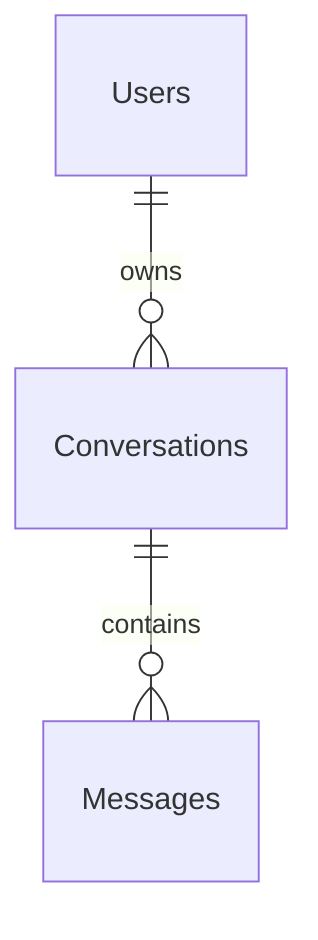
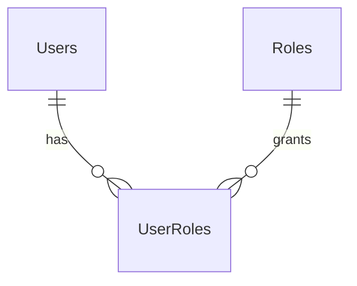

# Database through Day 3

PostgreSQL 17.11, database `spilton`. Tested instance uses the project-local Windows binaries; database files live in ignored `.local/postgres-data`. EF Core migration `20260908172950_InitialAuth` was generated and applied successfully.

Day 2 additively applies `20260909040101_AddConversationsAndMessages`. Original users, roles, authentication tables and data remain intact. PostgreSQL directly shows six tables, both migrations, and valid user/conversation/message relationships.

## Day 2 tables

Day 3 additionally applies `20260909054031_AddDocumentsAndRetrieval`, after privileged setup enables pgvector 0.8.6. Existing message rows receive empty document-ID arrays and valid empty citation JSON; no user/chat table was reset.

### Day 3 Documents and DocumentChunks

`Documents`: UUID Id/UserId FK; OriginalName, safe generated StoredName (unique), ContentType, Size, extensible Category, Status (UPLOADED/PROCESSING/READY/FAILED/DELETING), safe Error, optional PageCount, ChunkCount, EmbeddingModel, CreatedAt/UpdatedAt. Owner/date index supports the bounded user list. Each file produces one document, avoiding a redundant Files table.

`DocumentChunks`: UUID Id/DocumentId FK; ChunkIndex (unique within document), Content, optional real PageNumber/Section, TokenCount, `Embedding vector(384)`, CreatedAt. Cascade deletion removes document chunks/vectors. Exact cosine search is used; no approximate vector index is introduced for the small MVP.

`Messages` gains `DocumentIds uuid[]` and `CitationsJson jsonb`. IDs preserve selected context for reopening/regeneration. New citation records contain references and metadata; source excerpts are fetched from owned chunks rather than duplicated. Historic answer text is preserved after source deletion, but source access then returns unavailable. Full pipeline: [rag.md](rag.md).

### Conversations

| Column | Type | Purpose |
| --- | --- | --- |
| Id | uuid PK | Conversation identifier |
| UserId | uuid FK → Users | Required owner; enforced on every API operation |
| Title | varchar(100) | User rename or deterministic title from first message |
| CreatedAt | timestamptz | UTC creation timestamp |
| UpdatedAt | timestamptz | UTC ordering for recent activity |

Composite index `(UserId, UpdatedAt, Id)` supports owner-scoped recent history. No archived state is added because archive functionality is not implemented.

### Messages

| Column | Type | Purpose |
| --- | --- | --- |
| Id | uuid PK | Message identifier |
| ConversationId | uuid FK → Conversations | Required parent, cascade on conversation deletion |
| Sequence | integer | Stable order; unique with ConversationId |
| Role | varchar(16) | Database check: USER, ASSISTANT, SYSTEM |
| Content | varchar(32000) | Text; browser input limited to 8000 characters |
| ModelProvider | varchar(80), nullable | Assistant provenance |
| ModelName | varchar(120), nullable | Exact configured model / development model ID |
| Status | varchar(16) | Database check: completed, generating, cancelled, failed |
| ReplyToId | uuid, nullable | Logical identifier of the user message being answered |
| IsSuperseded | boolean | Retain previous generated versions while hiding successful replacements |
| CreatedAt | timestamptz | UTC timestamp |

`ReplyToId` is application-controlled metadata, not a separate ownership relationship; the actual FK is ConversationId. No endpoint accepts arbitrary roles, sequence numbers, owner IDs, provider provenance or reply IDs from the browser. System instructions are built by the server, not inserted from browser requests.



API list pages are capped at 100 conversations. Messages load the most recent 100 visible entries with a `before` sequence cursor for earlier entries. Provider context separately takes only bounded recent content; loading old messages does not expand model context without limits.

Per-conversation PostgreSQL session advisory locks prevent simultaneous sends, regeneration, rename and deletion races. User input and a pending assistant record are saved before the first stream event. Partials are periodically saved, then status/content finalized using an independent timeout even when the browser disconnects. User-requested deletion cascades through that user's selected conversation only and requires UI confirmation.

Previous answer rows are superseded only after a successful regeneration. There is no response-version browser UI yet. A background recovery pass marks abandoned generating rows failed after three minutes; saved checkpoints remain available.

## Tables

### Users

| Column | PostgreSQL type | Constraint/purpose |
| --- | --- | --- |
| Id | uuid | Primary key; generated in application |
| Name | varchar(100) | Required, trimmed; no whitespace-only input |
| Email | varchar(254) | Required, validated, trimmed |
| NormalizedEmail | varchar(254) | Required; invariant uppercase; unique index |
| PasswordHash | varchar(512) | Required; salted, versioned ASP.NET Identity hash |
| CreatedAt | timestamp with time zone | UTC creation time |
| UpdatedAt | timestamp with time zone | UTC; updated for EF-tracked user changes |
| IsActive | boolean | New users active; checked at login and JWT validation |

`IX_Users_NormalizedEmail` guarantees case-insensitive application email uniqueness under the documented normalization rule. Passwords are accepted only in auth requests, hashed immediately and never stored as plaintext. Register accepts 12–128 character non-blank passwords.

### Roles

| Column | Type | Constraint/purpose |
| --- | --- | --- |
| Id | uuid | Primary key |
| Name | varchar(50) | Required, unique |

Migration seeds only `User` with a fixed nonsecret identifier. No seeded accounts or passwords. Future roles can be added through reviewed migrations; registration does not accept a role from the client.

### UserRoles

`RolesId` and `UsersId` are UUID foreign keys with a composite primary key. Both references cascade on deletion; `UsersId` has a lookup index. This supports multiple roles per user without adding authentication/session entities prematurely.

### __EFMigrationsHistory

EF Core's migration metadata table. It contains migration ID and EF version, not application authentication data.



## Migration commands

From the project root in PowerShell:

```powershell
. .\scripts\dev-environment.ps1
dotnet tool restore
dotnet ef migrations add DescriptiveName --project backend/Spilton.Api
dotnet ef database update --project backend/Spilton.Api
dotnet ef migrations has-pending-model-changes --project backend/Spilton.Api
```

For ordinary startup, use `scripts/migrate.ps1`; do not create a new migration. Migrations are explicit, not automatically run on API startup. Review generated SQL before future deployments. Never delete the data directory to resolve an ordinary migration problem.

## Verification performed

- Applied the initial migration to actual PostgreSQL.
- Queried all four tables through `psql`.
- Registered users through API and browser; logged in using stored password hashes and read the same profile through the protected endpoint.
- Verified the stored hash fields are populated and timestamps are ordered.
- Verified `spilton` has neither superuser nor role-creation privileges in the tested native instance.
- Verified a duplicate email differing only in case is rejected with 409.

Test accounts under `example.test` are retained as local test data. They use random passwords, and none is a default login for the user.

The local administrator password and application credentials are separately generated and ignored by Git. The optional Compose image uses its initialization role as a development database owner; Compose was not runtime-tested. The native and Compose databases use separate storage.
